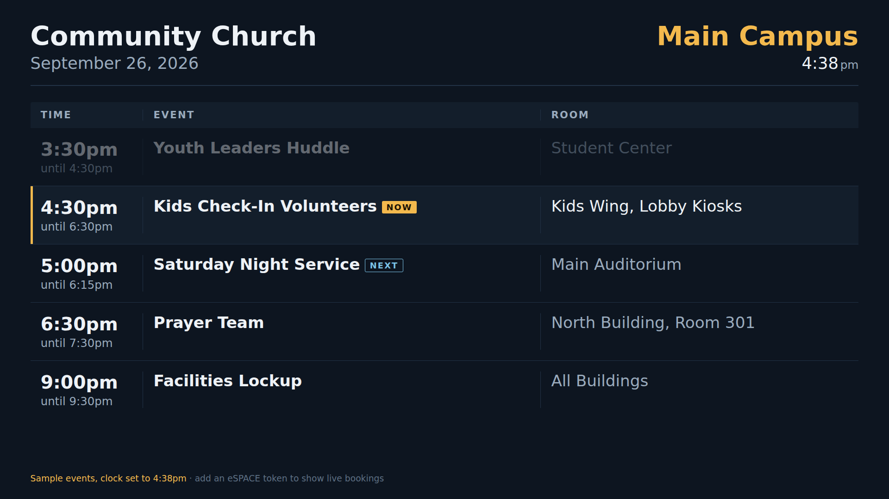

# Campus Board

A lobby TV display that shows today's room bookings from **eSPACE Event Scheduler**, one board per campus.



- Three columns (Time, Event and Room). The current event is highlighted and the one after it is tagged as next.
- Pulls from eSPACE once a day, then refreshes every 15 minutes to catch same-day changes (both configurable).
- Caches the last good pull to disk, so the boards keep showing it if eSPACE or your internet goes down.
- Runs on Windows, macOS, Linux or Docker (amd64 and arm64, so a Raspberry Pi works). Written in TypeScript, with no runtime dependencies beyond Node 18+.
- Your eSPACE API key stays on your server and never reaches the TVs.

> **Unofficial.** This project is not affiliated with or endorsed by Smart Church Solutions / eSPACE.
> You need an eSPACE subscription tier that includes API access (check Settings > Other > Billing > Manage).

---

## How it works

```
eSPACE API  ──(daily + every 15 min)──▶  Campus Board server  ──▶  TV at /board/main
                                          (caches to disk)     ──▶  TV at /board/north
```

One server can run every campus. Each TV opens its own campus URL in a full-screen browser.

## Quick start

### 1. Get an eSPACE API key

1. In eSPACE, create an API key (a long code like `1b4e28ba-2fa1-11d2-883f-0016d3cca427`). eSPACE's support article **"APIv2 | Keys & Tokens"** shows where.
   Tie it to a dedicated eSPACE user if you can, so a staff member leaving doesn't take the boards down with them.
2. That's all. The server trades the key for an access token itself and renews it if it ever expires. Nobody needs to open eSPACE's Swagger page.

### 2. Configure

Settings are split so the one secret never sits next to anything you'd share:

| File | Holds | In Git? |
|---|---|---|
| `.env` | `ESPACE_API_KEY` (and `TZ`) | No, ignored |
| `config.json` | Church name, schedule, filters, campuses | No, ignored |
| `.env.example`, `config.example.json` | Templates with no secrets | Yes |

```sh
cp .env.example .env                 # paste the key after ESPACE_API_KEY=
cp config.example.json config.json   # church name + one entry per campus
```

Each campus needs its eSPACE location ID. To list them, add your key to `.env` and run `npm run locations`
(with Docker: `docker compose run --rm campus-board node dist/server.js --locations`). With no key, the server runs in **demo mode** and shows sample events, which is handy for testing TVs.

| Setting | Default | What it does |
|---|---|---|
| `org` | | Church name at the top left |
| `timezone` | `America/Los_Angeles` | Default time zone; a campus can override it with its own `timezone` |
| `dailyPullAt` | `04:00` | Full pull each morning, campus local time |
| `refreshMinutes` | `15` | Extra pulls through the day. `0` = once a day only |
| `hidePastAfterMinutes` | `15` | Minutes after an event ends before it leaves the board. `0` = as soon as it ends, `null` = keep the whole day. A campus can override it |
| `espace.onlyApproved` | `true` | Hide pending or denied bookings |
| `espace.onlyPublic` | `false` | Set `true` to hide private or staff-only events on public screens |
| `campuses.<key>.hideRooms` | `[]` | Room names never shown on that campus's board (e.g. storage, offices) |

### 3. Run it

**Docker (recommended)**

```sh
docker compose up -d
```

Or without Compose:

```sh
docker run -d --name campus-board --restart unless-stopped -p 8080:8080 \
  --env-file .env \
  -v "$PWD/config.json:/config/config.json:ro" -v campus-board-data:/data \
  ghcr.io/OWNER/REPO:latest
```

**Node, any OS** (Node 18 or newer)

```sh
npm ci            # installs the TypeScript compiler (build-time only)
npm run build     # compiles src/ to dist/
npm run pull      # one test pull; prints what eSPACE returned
npm start         # start the server on port 8080
```

To run it as a service that starts on boot, use one of the files in `deploy/`:

| OS | File |
|---|---|
| Linux | `campus-board.service` (systemd) |
| macOS | `org.campusboard.server.plist` (launchd) |
| Windows | `install-windows-service.ps1` (startup task and firewall rule) |

Open `http://<server>:8080/` to see a link to every campus board.

### 4. Point the TVs at it

Any device with a modern browser works: a Raspberry Pi, a mini PC, a Mac mini or a smart-TV browser. Launchers in `deploy/`:

```sh
deploy/kiosk-linux.sh      http://board-server:8080/board/main
deploy/kiosk-mac.command   http://board-server:8080/board/main
deploy/kiosk-windows.cmd   http://board-server:8080/board/main
```

Each board page reloads itself at 3am, so TVs pick up updates without anyone touching them.

## Endpoints

| Path | Returns |
|---|---|
| `/board/<campus>` | The TV display |
| `/api/today/<campus>` | Today's events as JSON |
| `/health` | `200` when every campus pulled today, `503` otherwise. Point your RMM or uptime monitor here |
| `POST /api/refresh` | Pull now (limited to once a minute) |

## How eSPACE data is used

Campus Board reads `GET /api/v2/event/occurrences` from eSPACE's public API ([spec](https://api.espace.cool/swagger/ui/index)), filtered by `locationIds` and today's date. From each occurrence it shows:

| Board | eSPACE field |
|---|---|
| Time | `EventStart`, `EventEnd` (event time, not setup or teardown); `IsAllDay` shows "All day" |
| Event | `EventName` |
| Room | `Items` where `ItemType` is `Space` (equipment and services are left out) |
| Shown at all | `IsFinalApproved` (with `onlyApproved`), `IsPublic` (with `onlyPublic`) |

Contact names, emails and phone numbers are never read, so they can't end up on a public screen. The mapping lives in `mapOccurrence()` in `src/server.ts`.

## Development

```sh
npm ci
npm run check     # type-check only
npm run dev       # build and start
```

The server reads `.env` itself when run with Node, so the key lives in the same place with or without Docker. A real environment variable always wins over `.env`.

The server is `src/server.ts`. `npm run build` compiles it to `dist/server.js`, which is what Node and Docker run.
The TV page, `public/index.html`, is plain HTML, CSS and JavaScript with no build step.

## Matching your church's branding

Add a `theme` block to `config.json`. No code edits or rebuilds are needed, and your colors survive updates. Every key is optional; anything left out keeps the default look. A campus can also carry its own `theme` that overrides the shared one.

```json
"theme": {
  "background": "#101820",
  "surface":    "#1a2530",
  "rule":       "#2c3a47",
  "text":       "#f2f4f5",
  "textMuted":  "#a8b3bc",
  "textFaint":  "#6f7c86",
  "accent":     "#e0a526",
  "accentText": "#101820",
  "next":       "#7fc4e6",
  "fontDisplay": "\"Oswald\", \"Arial Narrow\", sans-serif",
  "fontBody":    "\"Source Sans 3\", system-ui, sans-serif",
  "fontsUrl":    "https://fonts.googleapis.com/css2?family=Oswald:wght@500;700&family=Source+Sans+3:wght@400;700&display=swap"
}
```

| Key | Used for |
|---|---|
| `background`, `surface`, `rule` | Page, the header band and "Now" row, the lines between rows and columns |
| `text`, `textMuted`, `textFaint` | Event names, then times and rooms, then the footer |
| `accent`, `accentText` | Campus name, "Now" tag and row stripe; the text on the "Now" tag |
| `next` | The "Next" tag |
| `fontDisplay`, `fontBody`, `fontsUrl` | Heading and body fonts, and the stylesheet that loads them |
| `displayWeight`, `displayWeightLight` | Set both to `400` for single-weight faces such as Bebas Neue, so browsers don't fake a bold |

Colors must be hex values. Invalid values are ignored with a warning in the log, never injected into the page.

Tips for TVs: check that text colors reach at least 4.5:1 contrast against `background` (brand link blues are often too dark on a dark screen), and keep `background` dark if your screens are OLED.

## Customizing further

The display is a single file, `public/index.html`. Text sizes scale with the screen, so the same page works on 720p, 1080p, 4K and portrait displays.

## License

MIT
